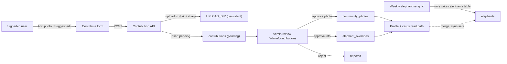

# Contributions + Kaggle-style UX

## Goals
- Let signed-in users **add photos** and **suggest info edits** for any elephant.
- Everything goes through a **moderation queue**; approved data lives in **separate tables** so the weekly elephant.se sync never clobbers it.
- Photo files stored on **Hostinger persistent disk**, served via a streaming route.
- Shift the profile experience toward a **Kaggle dataset** look and improve overall usability.

## Architecture: contribution flow

## Phase 1 - Auth (accounts)
Use Auth.js v5 (`next-auth@beta`) with JWT sessions, Credentials + Google providers, backed by MySQL. Passwords hashed with `bcryptjs`. Roles: `user | moderator | admin`.

- New deps: `next-auth@beta`, `bcryptjs` (+ `@types/bcryptjs` dev), `sharp`. IDs via built-in `crypto.randomUUID()`.
- `users` table (see schema). Google sign-in upserts by email; `ADMIN_EMAILS` env auto-grants admin to bootstrap the first moderator.
- New files:
  - `src/auth.ts` - NextAuth config (providers, jwt/session callbacks attaching `userId` + `role`).
  - `src/app/api/auth/[...nextauth]/route.ts` - handlers.
  - `src/app/api/auth/signup/route.ts` - POST create credentials user.
  - `src/lib/auth-db.ts` - `getUserByEmail`, `createUser`, `upsertOAuthUser`, `getUserById`.
  - `src/app/login/page.tsx`, `src/app/signup/page.tsx`.
  - Update `[src/components/layout/Header.tsx](src/components/layout/Header.tsx)` - Sign in / avatar menu (My contributions, Admin, Sign out).
- Env: `AUTH_SECRET`, `AUTH_URL=https://mahoot.xyz`, `AUTH_TRUST_HOST=true`, `GOOGLE_CLIENT_ID`, `GOOGLE_CLIENT_SECRET`, `ADMIN_EMAILS`. (`AUTH_URL=http://localhost:3000` in dev.)

## Phase 2 - Data model (sync-safe)
Add tables to `[infra/mysql/schema.sql](infra/mysql/schema.sql)` and a migration in the sync script's migrate path so `npm run sync:migrate` creates them. New lib `src/lib/contribution-db.ts`.

- `users` - id, email (unique), password_hash (nullable for OAuth), name, image, provider, role, created_at.
- `contributions` - id, elephant_id, user_id, type(`info|photo`), payload JSON, status(`pending|approved|rejected`), reviewer_id, review_note, created_at, reviewed_at.
- `community_photos` - id, elephant_id, contribution_id, url, credit, caption, uploaded_by, created_at.
- `elephant_overrides` - elephant_id (PK), fields JSON (whitelisted), updated_by, updated_at.

`info` payload = only changed, whitelisted fields (name, sex, status, subspecies, birthDate, birthPlace, ageYears, origin, country, fatherName, motherName, management). `photo` payload = uploaded file refs + credit/caption.

## Phase 3 - Upload + submission APIs (auth required)
- `src/app/api/contributions/photo/route.ts` - POST multipart; validate mime + size (cap ~8MB); `sharp` -> resized WebP (cap ~2000px, strip EXIF); write to `UPLOAD_DIR`; insert pending `contributions` row.
- `src/app/api/uploads/[...path]/route.ts` - GET streams files from `UPLOAD_DIR` with content-type + long cache; reject path traversal.
- `src/app/api/contributions/route.ts` - POST info edit (whitelist fields, diff vs current record) -> pending row.
- `src/app/api/contributions/mine/route.ts` - GET current user's submissions.

## Phase 4 - Moderation
- `src/app/admin/contributions/page.tsx` - role-gated (moderator/admin) queue with approve/reject + note.
- `src/app/api/admin/contributions/[id]/route.ts` - PATCH approve/reject.
  - Approve `photo` -> insert `community_photos`. Approve `info` -> upsert `elephant_overrides`. Reject -> mark + optionally delete orphaned file.
- `src/middleware.ts` - guard `/admin/*`.

## Phase 5 - Read-path integration (sync-safe merge)
- `[src/lib/elephants.ts](src/lib/elephants.ts)` `getElephantById` -> apply `elephant_overrides` over the synced record (whitelisted keys only).
- `[src/lib/elephantEnrichments.ts](src/lib/elephantEnrichments.ts)` `mergeProfilePhotos` -> add `communityPhotos` arg; profile page (`[src/app/elephants/[id]/page.tsx](src/app/elephants/[id]/page.tsx)`) fetches `getCommunityPhotos(id)` and passes them. Order: community -> enrichment -> elephant.se.
- Photo credits show contributor name; cards may prefer a community cover photo (extends existing `enrichSearchResults`).

## Phase 6 - Kaggle-style profile redesign + usability
Rework `[src/app/elephants/[id]/page.tsx](src/app/elephants/[id]/page.tsx)` and `[src/components/elephants/ElephantProfileHero.tsx](src/components/elephants/ElephantProfileHero.tsx)` from the image-hero/charity layout to a dataset-style header.

Confirmed decisions:
- **Header image: slim banner (~16:5)** above the metadata (not a full-bleed hero, not a thumbnail). Main/extra photos still live in the Photos tab.
- **Tabbed sections** (client `ProfileTabs`), content server-rendered: Overview / Lineage / Herd / Photos / Activity. No refetch on tab switch.

Layout (top to bottom):
- **Breadcrumb**: Database / {Country} / {Camp}.
- **Header**: title + status/subspecies chips; right-aligned action buttons (**Add photo**, **Suggest edit** - login-gated, wired fully in Phases 1-4); slim ~16:5 banner.
- **Metadata strip**: sex, age, origin, chip ID, location, last updated (dense label/value).
- **Record completeness meter** (`RecordCompleteness`): share of populated fields, Kaggle "usability" analog to nudge contributions.
- **Tabs** reuse existing sections: `ElephantLineageSection`, `ElephantHerdSection`, `ElephantPhotoGallery`, `ElephantDetailPanels`, `ElephantEnrichmentStory`; Activity shows recent approved contributions + "Last updated".
- New components: `Breadcrumb`, `ProfileHeader`, `ProfileTabs`, `RecordCompleteness` (Phase 6); `ContributeButtons`, `ContributePhotoForm`, `ContributeInfoForm`, `ContributionActivity` (wired in Phases 1-4).
- Keep the catalog portal palette (slate surfaces, forest accent).
- Broader usability: breadcrumbs across the portal, `/` keyboard shortcut to focus search, profile skeletons, contributor credit links, "My contributions" page.

## Deploy / setup notes
- Public domain: **mahoot.xyz** on Hostinger Node hosting. Point DNS (A/AAAA or Hostinger app target) for `mahoot.xyz` (and `www`) at the Node app and enable SSL in hPanel so the canonical origin is `https://mahoot.xyz`. Hostinger DNS/domain can be managed via the available Hostinger MCP tools if needed.
- Auth: set `AUTH_URL=https://mahoot.xyz` and `AUTH_TRUST_HOST=true` in production; uploaded-photo and OAuth callback URLs all resolve under this origin.
- Google OAuth (Cloud Console): authorized redirect URIs `https://mahoot.xyz/api/auth/callback/google` (prod) and `http://localhost:3000/api/auth/callback/google` (dev); authorized JS origin `https://mahoot.xyz`.
- `UPLOAD_DIR` must point at a **persistent path outside the git deploy dir** on Hostinger; served only via the uploads route (never committed). Files surface publicly as `https://mahoot.xyz/api/uploads/...`.
- Run `npm run sync:migrate` to create the new tables. Set `ADMIN_EMAILS` to grant yourself admin.
- `sharp` needs platform binaries on the Node host (standard install).

## Risks / decisions
- Auth.js v5 is beta - pin the version.
- Confirm Hostinger Node hosting keeps `UPLOAD_DIR` across deploys (use a path outside the release folder).
- Field overrides are whitelisted to avoid breaking typed fields; sync stays authoritative for everything else.

## Suggested sequencing
Phase 6 (Kaggle redesign) is independent of 1-5 and can ship first for a quick visible win, or last. Recommend: 1 -> 2 -> 3 -> 4 -> 5, then 6 (or 6 first if you want the look improvements immediately).